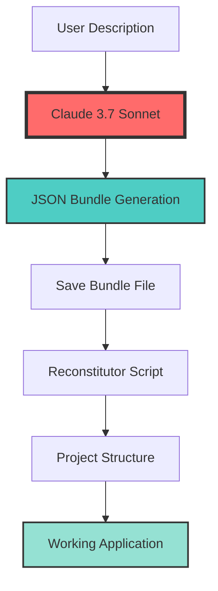

# 🚀 SaaS JSON Bundle Generator - AI-Powered Application Creator

<div align="center">
  
  
  
  <h3>🤖 Powered by Claude 3.7 Sonnet - From Idea to Full SaaS in Seconds</h3>
  
  [](https://python.org)
  [](https://www.anthropic.com/)
  [](https://flask.palletsprojects.com/)
  [](https://htmx.org/)
  [](https://tailwindcss.com/)
  [](LICENSE)
  
  <p align="center">
    <a href="#-concept">Concept</a> •
    <a href="#-features">Features</a> •
    <a href="#-demo">Demo</a> •
    <a href="#-quick-start">Quick Start</a> •
    <a href="#-usage">Usage</a> •
    <a href="#-architecture">Architecture</a> •
    <a href="#-examples">Examples</a>
  </p>

  
  
  
</div>

---

## 📋 Table of Contents

- [Concept](#-concept)
- [Features](#-features)
- [Demo](#-demo)
- [Requirements](#-requirements)
- [Installation](#-installation)
- [Quick Start](#-quick-start)
- [Usage](#-usage)
- [JSON Bundle Structure](#-json-bundle-structure)
- [Architecture](#-architecture)
- [Examples](#-examples)
- [Advanced Usage](#-advanced-usage)
- [Contributing](#-contributing)
- [Cost Analysis](#-cost-analysis)
- [License](#-license)

## 🎯 Concept

**SaaS JSON Bundle Generator** is a revolutionary metaprogramming tool that transforms simple text descriptions into complete, production-ready SaaS applications. Using Claude 3.7 Sonnet's advanced reasoning capabilities, it generates comprehensive JSON bundles containing every file, configuration, and component needed for a fully functional web application.

### 🔥 The Magic

```
"Create a task management SaaS with user authentication" 
                    ↓
              Claude 3.7 Sonnet
                    ↓
        Complete JSON Bundle (64K tokens)
                    ↓
            Reconstitutor Script
                    ↓
        Full Working SaaS Application
```

### 💡 Why JSON Bundles?

- **Portability**: One JSON file contains the entire application
- **Version Control**: Track complete application states
- **Reproducibility**: Recreate exact applications anytime
- **Modularity**: Mix and match components from different bundles
- **AI-Friendly**: Perfect format for AI generation and modification

## ✨ Features

### 🤖 AI-Powered Generation
- **Claude 3.7 Sonnet**: Latest model with 64K token output capacity
- **Intelligent Understanding**: Interprets vague descriptions into complete specs
- **Best Practices**: Automatically implements security, validation, and patterns
- **Complete Code**: Generates full, working code - not templates

### 🏗️ Full-Stack Applications
- **Flask Backend**: RESTful APIs with proper routing
- **SQLAlchemy ORM**: Database models and migrations
- **HTMX Frontend**: Modern interactivity without JavaScript frameworks
- **Tailwind CSS**: Beautiful, responsive designs via CDN
- **Authentication**: Complete user auth system when requested

### 📦 Bundle System
- **Self-Contained**: Everything in one JSON file
- **Reconstitutor**: Auto-generated script to rebuild projects
- **Metadata**: Version tracking and feature documentation
- **Dependencies**: Automatic requirements.txt generation
- **Tests**: Basic test suites included

### ⚡ Developer Experience
- **Interactive Mode**: Chat-like interface for iterative development
- **Progress Tracking**: Real-time generation status with timer
- **Error Handling**: Comprehensive error messages and debugging
- **One Command**: From idea to running application

## 🎮 Demo

<div align="center">

### 🚀 Creating a Complete SaaS in 30 Seconds
```bash
$ python json_bundle_generator.py "Create a customer feedback SaaS with dashboard"

🔍 Analyzing requirements...
📝 Description: Create a customer feedback SaaS with dashboard
🧠 Generating JSON bundle with Claude 3.7 Sonnet...
⏳ Generating... | 00:28
✅ JSON bundle generated successfully in 0m 28s
📦 Bundle saved to: customer_feedback_bundle_20240315_143021.json
🔧 Reconstitutor saved to: reconstitutor.py

Bundle Statistics:
  • Name: customer-feedback-saas
  • Description: Customer feedback collection and analytics platform
  • Files: 12
  • Features: auth, crud, api, dashboard, analytics

To reconstitute the project:
  python reconstitutor.py customer_feedback_bundle_20240315_143021.json
```

### 📊 Reconstituting and Running
```bash
$ python reconstitutor.py customer_feedback_bundle_20240315_143021.json

✅ Created project directory: customer-feedback-saas_20240315_143052
✅ Created directory: app
✅ Created directory: templates
✅ Created directory: static
✅ Created directory: models
✅ Created file: app.py
✅ Created file: models/models.py
✅ Created file: templates/base.html
✅ Created file: templates/index.html
✅ Created file: templates/dashboard.html
✅ Created requirements.txt
✅ Created README.md

✨ Project created successfully in customer-feedback-saas_20240315_143052
📦 To run the application:
   cd customer-feedback-saas_20240315_143052
   pip install -r requirements.txt
   python app.py
```

</div>

## 📋 Requirements

### System Requirements
- Python 3.8 or higher
- 2GB RAM minimum
- Internet connection for API calls

### Dependencies
```python
anthropic>=0.18.0
python-dotenv>=0.19.0
```

## 🚀 Installation

### 1. Clone the Repository
```bash
git clone https://github.com/yourusername/saas-json-bundle-generator.git
cd saas-json-bundle-generator
```

### 2. Set Up Virtual Environment
```bash
# Create virtual environment
python -m venv venv

# Activate it
# Windows:
venv\Scripts\activate
# Linux/Mac:
source venv/bin/activate
```

### 3. Install Dependencies
```bash
pip install -r requirements.txt
```

### 4. Configure API Key
```bash
# Create .env file
echo "ANTHROPIC_API_KEY=your_anthropic_api_key_here" > .env

# Or export directly
export ANTHROPIC_API_KEY=your_anthropic_api_key_here
```

### 5. Get Your Anthropic API Key
1. Visit [Anthropic Console](https://console.anthropic.com/)
2. Create an account or sign in
3. Navigate to API Keys
4. Create a new key with Claude 3.7 Sonnet access
5. Copy the key to your `.env` file

## ⚡ Quick Start

### Generate Your First SaaS
```bash
# Simple command
python json_bundle_generator.py "Create a blog platform with comments"

# With custom output path
python json_bundle_generator.py "Create an inventory management system" -o inventory_bundle.json

# Interactive mode
python json_bundle_generator.py -i
```

### Reconstitute and Run
```bash
# Reconstitute the bundle
python reconstitutor.py blog_platform_bundle_*.json

# Navigate to project
cd blog-platform_*

# Install dependencies
pip install -r requirements.txt

# Run the application
python app.py

# Open http://localhost:5000
```

## 💻 Usage

### Command Line Interface

```bash
usage: json_bundle_generator.py [-h] [-o OUTPUT] [-i] [description]

Generate SaaS JSON bundles

positional arguments:
  description           Description of the SaaS application to generate

optional arguments:
  -h, --help            show this help message and exit
  -o OUTPUT, --output OUTPUT
                        Output path for the JSON bundle
  -i, --interactive     Run in interactive mode
```

### Interactive Mode

```bash
$ python json_bundle_generator.py -i

🤖 SaaS JSON Bundle Generator - Interactive Mode
Describe the SaaS application you want to create. Type 'exit' to quit.

> Create a project management tool with kanban boards
🔍 Analyzing requirements...
📝 Description: Create a project management tool with kanban boards
🧠 Generating JSON bundle with Claude 3.7 Sonnet...
✅ JSON bundle generated successfully in 0m 35s
📦 Bundle saved to: project_management_bundle_20240315_144523.json

> Create an e-learning platform with course creation
🔍 Analyzing requirements...
[...]

> exit
👋 Goodbye!
```

### Python API

```python
from json_bundle_generator import JsonBundleGenerator

# Initialize generator
generator = JsonBundleGenerator(api_key="your_api_key")

# Generate a bundle
output_path = generator.generate(
    description="Create a CRM system with pipeline management",
    output_path="crm_bundle.json"
)

if output_path:
    print(f"Bundle created: {output_path}")
```

## 📄 JSON Bundle Structure

### Complete Bundle Schema
```json
{
    "metadata": {
        "name": "saas-name",
        "version": "1.0.0",
        "description": "Complete description of the SaaS",
        "created_at": "2024-03-15T14:45:23Z"
    },
    "structure": {
        "directories": ["app", "templates", "static", "models"],
        "files": {
            "app.py": {
                "type": "python",
                "content": "from flask import Flask, render_template..."
            },
            "templates/index.html": {
                "type": "html",
                "content": "<!DOCTYPE html>..."
            },
            "models/models.py": {
                "type": "python",
                "content": "from flask_sqlalchemy import SQLAlchemy..."
            }
        }
    },
    "dependencies": {
        "python": [
            "flask==3.0.0",
            "flask-sqlalchemy==3.1.1",
            "python-dotenv==1.0.0"
        ],
        "frontend": [
            "htmx@1.9.10",
            "tailwindcss@3.4.0"
        ]
    },
    "database": {
        "type": "sqlite",
        "models": {
            "User": {
                "fields": {
                    "id": {"type": "integer", "primary_key": true},
                    "email": {"type": "string", "unique": true},
                    "password_hash": {"type": "string", "required": true}
                }
            }
        }
    },
    "routes": {
        "/": {
            "methods": ["GET"],
            "handler": "index",
            "template": "index.html"
        },
        "/api/users": {
            "methods": ["GET", "POST"],
            "handler": "api_users"
        }
    },
    "features": ["auth", "crud", "api", "dashboard"],
    "config": {
        "port": 5000,
        "debug": true,
        "secret_key": "dev-secret-key-change-in-production"
    }
}
```

## 🏗️ Architecture

### System Flow


### Technology Stack
- **Backend**: Flask (Python web framework)
- **Database**: SQLAlchemy ORM with SQLite
- **Frontend**: HTMX for interactivity
- **Styling**: Tailwind CSS via CDN
- **Templates**: Jinja2 templating engine

### Generated Project Structure
```
generated-saas/
│
├── app.py                 # Main Flask application
├── requirements.txt       # Python dependencies
├── README.md             # Project documentation
├── .env                  # Environment variables
│
├── models/               # Database models
│   └── models.py        
│
├── templates/            # HTML templates
│   ├── base.html        # Base layout
│   ├── index.html       # Homepage
│   └── dashboard.html   # User dashboard
│
├── static/               # Static assets
│   ├── css/            
│   └── js/             
│
└── tests/                # Test suite
    ├── test_unit.py     
    └── test_integration.py
```

## 📚 Examples

### 1. Task Management SaaS
```bash
python json_bundle_generator.py "Create a task management SaaS with projects, tasks, subtasks, user assignments, due dates, and email notifications"
```

**Generated Features:**
- User authentication and authorization
- Project CRUD with team members
- Task management with drag-and-drop
- Email notification system
- Dashboard with statistics
- RESTful API endpoints

### 2. E-commerce Platform
```bash
python json_bundle_generator.py "Build an e-commerce platform with product catalog, shopping cart, checkout, order management, and admin panel"
```

**Generated Features:**
- Product catalog with categories
- Shopping cart functionality
- Secure checkout process
- Order tracking
- Admin panel for inventory
- Customer accounts

### 3. Learning Management System
```bash
python json_bundle_generator.py "Design an LMS with course creation, video lessons, quizzes, progress tracking, and certificates"
```

**Generated Features:**
- Course creation and management
- Video lesson integration
- Quiz builder and grading
- Student progress tracking
- Certificate generation
- Instructor dashboard

## 🔧 Advanced Usage

### Custom System Prompts
Modify the `SYSTEM_PROMPT` in the source code to:
- Add specific technologies
- Include custom patterns
- Enforce coding standards
- Add domain-specific features

### Batch Generation
```python
descriptions = [
    "Create a CRM system",
    "Build a project management tool",
    "Design a booking platform"
]

for desc in descriptions:
    generator.generate(desc)
    time.sleep(5)  # Rate limiting
```

### Bundle Modification
```python
# Load existing bundle
with open('existing_bundle.json', 'r') as f:
    bundle = json.load(f)

# Modify bundle
bundle['features'].append('new-feature')
bundle['structure']['files']['new_file.py'] = {
    'type': 'python',
    'content': 'print("New feature")'
}

# Save modified bundle
with open('modified_bundle.json', 'w') as f:
    json.dump(bundle, f, indent=2)
```

## 💰 Cost Analysis

### Claude 3.7 Sonnet Pricing
- **Input**: $3 per million tokens
- **Output**: $15 per million tokens

### Typical Generation Costs
| Application Type | Input Tokens | Output Tokens | Estimated Cost |
|-----------------|--------------|---------------|----------------|
| Simple SaaS | ~1,000 | ~30,000 | ~$0.45 |
| Medium SaaS | ~1,500 | ~45,000 | ~$0.68 |
| Complex SaaS | ~2,000 | ~60,000 | ~$0.91 |

### Cost Optimization Tips
1. Use concise, clear descriptions
2. Specify only necessary features
3. Reuse bundles as templates
4. Batch similar projects

## 🤝 Contributing

We welcome contributions! Please see our [Contributing Guidelines](CONTRIBUTING.md).

### How to Contribute
1. Fork the repository
2. Create your feature branch (`git checkout -b feature/AmazingFeature`)
3. Commit your changes (`git commit -m 'Add some AmazingFeature'`)
4. Push to the branch (`git push origin feature/AmazingFeature`)
5. Open a Pull Request

### Areas for Contribution
- 🎨 **Templates**: Add new application templates
- 🔧 **Features**: Extend bundle capabilities
- 📚 **Documentation**: Improve guides and examples
- 🧪 **Testing**: Add test coverage
- 🌍 **i18n**: Multi-language support

## 🗺️ Roadmap

### Version 1.1
- [ ] Multiple AI model support
- [ ] Bundle marketplace
- [ ] Visual bundle editor
- [ ] Docker containerization

### Version 1.2
- [ ] Real-time collaboration
- [ ] Cloud deployment scripts
- [ ] CI/CD integration
- [ ] Performance monitoring

### Version 2.0
- [ ] GUI application
- [ ] Plugin system
- [ ] Enterprise features
- [ ] Advanced customization

## 🛡️ Security Considerations

### Generated Applications
- Default secrets are for development only
- Always change production credentials
- Review generated authentication code
- Implement proper HTTPS in production

### API Key Security
- Never commit API keys
- Use environment variables
- Rotate keys regularly
- Monitor usage

## 📄 License

This project is licensed under the MIT License - see the [LICENSE](LICENSE) file for details.

## 🙏 Acknowledgments

- [Anthropic](https://www.anthropic.com/) for Claude 3.7 Sonnet
- [Flask](https://flask.palletsprojects.com/) community
- [HTMX](https://htmx.org/) for modern web interactivity
- [Tailwind CSS](https://tailwindcss.com/) for beautiful designs
- All contributors and users

---

<div align="center">
  
  **[⬆ Back to top](#-saas-json-bundle-generator---ai-powered-application-creator)**
  
  Made with ❤️ and 🤖 by the SaaS Bundle Team
  
  [](https://github.com/yourusername/saas-json-bundle-generator)
  [](https://twitter.com/intent/tweet?text=Check%20out%20this%20amazing%20SaaS%20generator!&url=https%3A%2F%2Fgithub.com%2Fyourusername%2Fsaas-json-bundle-generator)
  
  <sub>Transform ideas into applications at the speed of thought 💭</sub>
  
</div>
